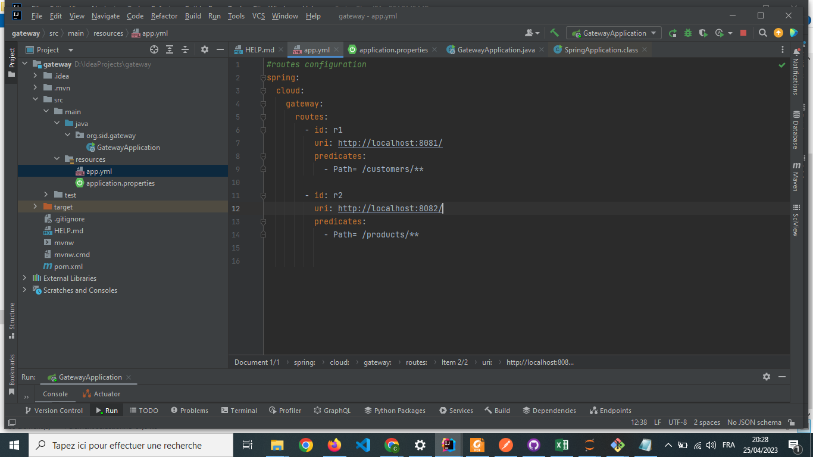
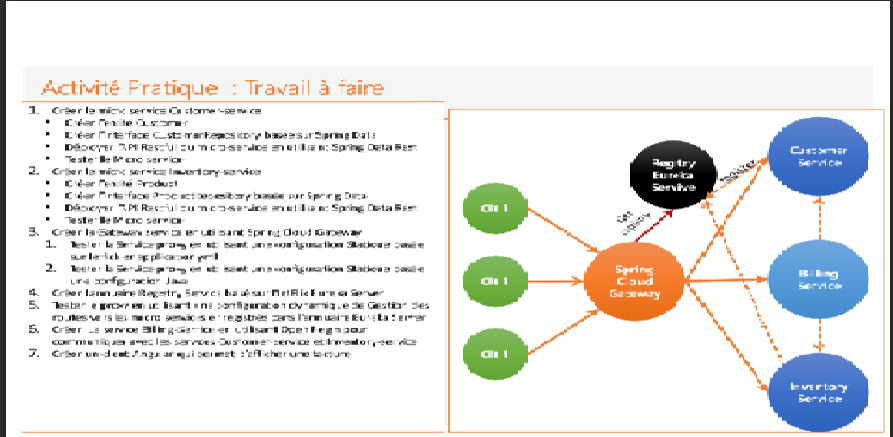
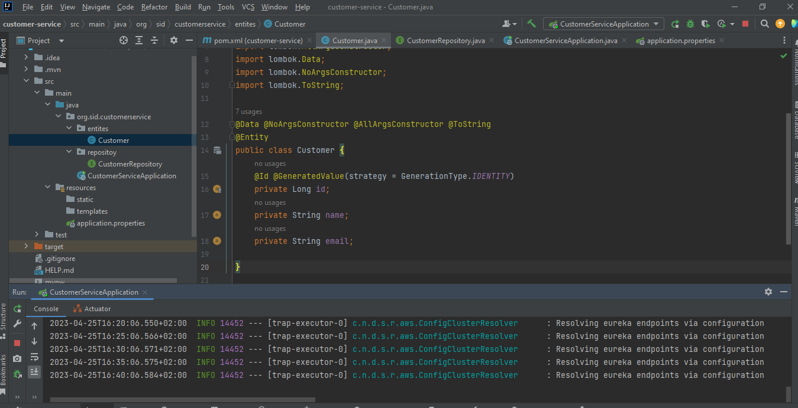

  

<h2>Activité pratique N°5 : Architecture Micro-services avec Spring Cloud</h2>
<h1>compte rendu</h1>
<h1>Beidja Cheikh</h1>
<h2>Master SDIA </h2>  
  
<h4>1. Créer le micro service Customer-service</h4>
<h4>• Créer l’entité Customer </h4> 
  

